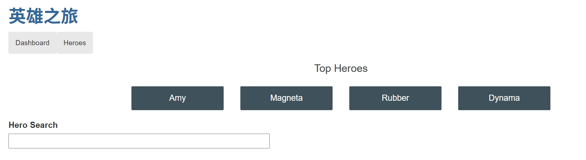
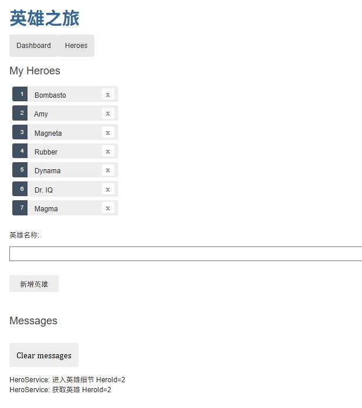
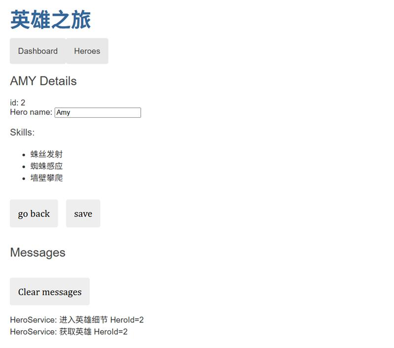

<div id="top"></div>


[![.Net][.Net]][.Net] [![Angular CLI]][Angular CLI] [![npm]][Angular CLI]

<!-- 项目 LOGO -->
<br />
<div align="center">
  <a href="https://github.com/jzr778/TourOfHeroes">
    
  </a>

  <h3 align="center">Tour-Of-Heroes</h3>

  <p align="center">
    一个基于Angular和C#构建的前后端分离入门小项目，供初学者快速上手！
    <br />
    <a href="https://github.com/jzr778/TourOfHeroes"><strong>浏览文档 »</strong></a>
    <br />
    <br />
    <a href="https://github.com/jzr778/TourOfHeroes">查看 Demo</a>
    ·
    <a href="https://github.com/jzr778/TourOfHeroes/issues">反馈 Bug</a>
    ·
    <a href="https://github.com/jzr778/TourOfHeroes/issues">请求新功能</a>
  </p>
</div>


<!-- 目录 -->
<details>
  <summary>目录</summary>
  <ol>
    <li>
      <a href="#关于本项目">关于本项目</a>
      <ul>
        <li><a href="#页面展示">页面展示</a></li>
        <li><a href="#构建工具">构建工具</a></li>
      </ul>
    </li>
    <li><a href="#快速开始">快速开始</a></li>
    <li><a href="#致谢">致谢</a></li>
  </ol>
</details>


<!-- 关于本项目 -->
## :heart:关于本项目

这是一个基于Angular和C#构建的前后端分离入门小项目，<mark>仅供初学者练手</mark>

### 页面展示
> 1. 导航



> 2. 展示所有角色



> 角色细节



| 前端地址| 后端地址|
|-|-|
|[jzr778/angular-tour-of-heroes](https://github.com/jzr778/angular-tour-of-heroes) | [jzr778/TourOfHeroes](https://github.com/jzr778/TourOfHeroes) |


<p align="right">(<a href="#top">返回顶部</a>)</p>

### 构建工具

- 本项目基于`.Net 8.0` 框架，使用 `NuGet` 安装 `EF core` 支持`.Net 8.0`
- 前端框架为 `Angular` ，项目地址 [jzr778/TourOfHeroes](https://github.com/jzr778/TourOfHeroes)

<p align="right">(<a href="#top">返回顶部</a>)</p>


## :heart:快速开始

1. 克隆本仓库
   ```sh
   git clone https://github.com/jzr778/TourOfHeroes.git
   ```
2. 使用 `VS 2022` 自动为项目生成解决方案
3. 运行，访问 `https://localhost:7287` 接口地址

<p align="right">(<a href="#top">返回顶部</a>)</p>


<!-- 致谢 -->
## :heart:致谢

本项目版本徽章由[Static Badge](https://shields.io/)生成

<p align="right">(<a href="#top">返回顶部</a>)</p>


<!-- MARKDOWN 链接 & 图片 -->
<!-- https://www.markdownguide.org/basic-syntax/#reference-style-links -->
[.Net]: https://img.shields.io/badge/.Net-8.0-%2300FFFF
[Angular CLI]: https://img.shields.io/badge/Angular_CLI-17.3.0-hotpink
[npm]: https://img.shields.io/badge/npm-9.5.0-thistle